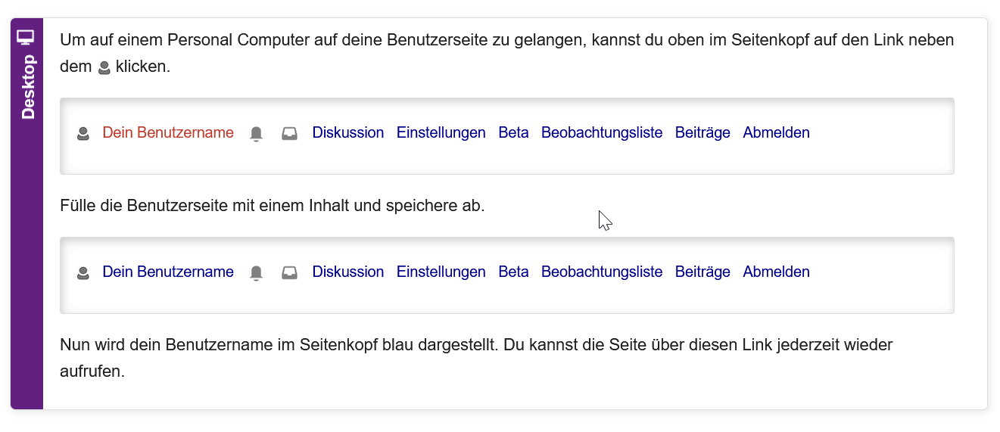

## Die Benutzerinnenseite

Über deine persönliche Benutzerseite kannst du dich als angemeldeter Benutzer kurz mit deinem eigenen Profil vorstellen, die damit verbundene Diskussionsseite ermöglicht auch eine gezielte Kommunikation mit dir. Die Anlage einer Benutzerseite ist nicht verpflichtend. Wenn Du eine Benutzerseite anlegen willst, solltest du allerdings einige wichtige Punkte beachten.

* Eine Benutzerseite ist keine private Homepage
* Alle Angaben, die hier eingestellt werden, sind öffentlich einsehbar.
* Du kannst dich und deine Interessen hier vorstellen, beachte dabei bitte die Hinweise zur Anonymität.
* Lege auf der Hauptbenutzerseite bitte keine Artikelentwürfe an.

## Eine kurze Beschreibung über dich auf die Benutzer\*innenseite ein

Stelle dich auf deiner Benutzerseite gerne kurz vor, füge ein Motto ein oder verlinke dir Seiten, die du beim Editieren oft brauchst.

!?[Ein kurze Anleitung findest du im Video:](ressources/Link_und_Motto.mp4 "Ein kurze Anleitung findest du im Video:")
